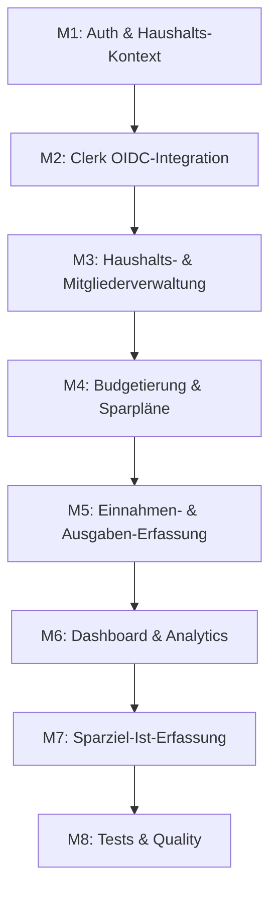

# Projekt-Roadmap & Implementierungsplan

Stand: M1–M5 sind im Code umgesetzt, M6 läuft teilweise (Overview-Daten werden im Backend berechnet, das Dashboard-Frontend zeigt sie aber noch nicht an).

## Meilensteine



### M1 — Auth & Haushalts-Kontext ✅
Mock-Authentifizierung per Cookie, Sidebar-Layout, Haushalts-Switcher, Seed-Daten.
Siehe `walkthrough.md` für die Details.

### M2 — Clerk OIDC-Integration ✅
Dual-Mode-Auth: läuft mit Clerk wenn Keys gesetzt sind, sonst weiter im Mock-Modus.
Wichtige Dateien:
- `nuxt.config.ts` — bedingtes Laden von `@clerk/nuxt`
- `server/middleware/auth.ts` — Modus-Switch (Clerk JWT vs. Mock-Cookie)
- `server/middleware/clerk.ts` — `clerkMiddleware()` (muss vor `auth.ts` laufen)
- `server/api/webhooks/clerk.post.ts` — Svix-verifizierter Webhook für User-Sync
- `server/utils/clerk-sync.ts` — Upsert + Invitations annehmen + Default-Haushalt anlegen
- `app/composables/useAppAuth.ts` — `@clerk/vue` Integration

### M3 — Haushalts- & Mitgliederverwaltung ✅
Endpoints unter `server/api/households/`:
- `households.post.ts` — Haushalt erstellen
- `households/[householdId].patch.ts` — Umbenennen
- `households/[householdId]/members.post.ts` — Mitglied hinzufügen
- `households/[householdId]/members/[membershipId].delete.ts` — entfernen
- `households/[householdId]/invitations/[invitationId].delete.ts` — Einladung widerrufen
- Frontend: `app/pages/households.vue`

### M4 — Budgetierung & Sparpläne ✅
Ein einziger Endpoint pro Haushalt mit `kind`-Dispatch:
- `POST/PATCH /api/households/:id/planning` mit `{ kind: 'budget' | 'incomePlan' | 'fixedCostPlan' | 'savingsGoal' }`
- `DELETE /api/households/:id/planning`
- Frontend: `app/pages/budgeting.vue`

Wichtige Helpers in `server/utils/planning.ts`:
- `parseMoneyToCents` — DE/EU/US-Formate (`1.234,56`, `1,234.56`, `1234,56`)
- `assertPeriodStart` — verlangt Periodenstart (1. des Monats, Montag bei WEEKLY, etc.)
- `isPeriodStart` / `assertPlanningKind` / `assertFrequency`

### M5 — Einnahmen- & Ausgaben-Erfassung ✅
- `GET/POST/PATCH/DELETE /api/households/:id/transactions`
- Frontend: `app/pages/transactions.vue`
- Helper: `server/utils/transactions.ts` (`assertTransactionKind`)

### M6 — Dashboard & Analytics ⚠️ Teilweise
- Backend fertig: `GET /api/households/current` liefert `household` + `budgetOverview` (berechnet via `server/utils/budget-evaluation.ts`)
- Frontend Lücke: `app/pages/index.vue` zeigt noch hardcoded Mock-Werte für Einnahmen/Fixkosten/Freies Budget/Sparziele
- **Nächster Schritt:** `index.vue` an `current.get.ts` hängen, geplante Einnahmen/Fixkosten aus `currentHousehold` ziehen, Budget-Progress-Bars rendern

### M7 — Sparziel-Ist-Erfassung 🔜
Schema hat `SavingsGoalExecution` für monatliche Ist-Sparrate, aber keine UI. Ohne UI kein realistischer Progress.

### M8 — Tests & Quality 🔜 (in Arbeit)
Vitest-Suite für `server/utils/*`. Deckt aktuell:
- Money-Parser (DE/EU/US-Formate, Edge-Cases)
- Date-Parser
- Period-Validation (WEEKLY/MONTHLY/QUARTERLY/YEARLY/ONCE)
- `Budget-Overview`-Berechnung (alle Frequenzen, Version-Overlaps, unassigned-Bucket)
- Auth-Mode-Switch
- Clerk User-Sync (mocked Prisma)
- Transaction-Kind-Validation

Lokal ausführen:
```bash
npm install
npm test           # watch mode
npm run test:run   # einmaliger Lauf (CI)
npm run test:coverage
```

## Architekturentscheidungen

### Dual-Mode Auth
`nuxt.config.ts` lädt `@clerk/nuxt` nur wenn beide Keys gesetzt sind. Wechsel zwischen Modi erfordert einen neuen Build — das ist Absicht (verhindert versehentliches Vermischen). `useAppAuth` und das `auth.ts`-Middleware prüfen den Modus zur Laufzeit.

### Versionierte Budgets (`Budget` ↔ `BudgetVersion`)
Budgets haben eine Historie von Versionen mit `validFrom`. Beim Speichern wird *nie* ein bestehendes Budget mutiert — wenn sich der Betrag ändert, wird eine neue Version angelegt. Das macht historische Auswertungen einfach.

### Geplant vs. Ist (getrennte Tabellen)
- Geplant: `IncomePlan`, `FixedCostPlan`, `Budget`, `SavingsGoal`
- Ist: `ExpenseTransaction`, `IncomeTransaction`, `SavingsGoalExecution`
Diese Trennung ist explizit gewollt — Forecasts und retrospective Auswertungen brauchen beide Perspektiven unabhängig voneinander.

### Cent-basierte Geldwerte
Alle Geldbeträge in der DB sind `Int` (Cents). Keine Floats. Umrechnung passiert ausschließlich an Display-Grenzen.

## Bekannte Quirks / offene Punkte

- **`buildBudgetOverview` zählt nur Perioden, die im aktuellen Monat starten.** Eine QUARTERLY-Version mit `validFrom=Apr 1` liefert für Juni `0 planned`, obwohl Q2 (April–Juni) Juni überdeckt. Designentscheidung ("Betrag wird am Periodenstart allokiert"), aber nicht offensichtlich. Falls du eine "Verteilung über den Monat"-Logik willst, müsste `countPeriodsInMonth` umgeschrieben werden.
- **`dashboard` zeigt Mock-Werte.** Siehe M6 oben.
- **Sparziel-Executions ohne UI.** Siehe M7 oben.
- **Kein zentraler Multi-Household-Aggregations-Endpoint.** Aktuell lädt das Frontend pro Haushalt separat.