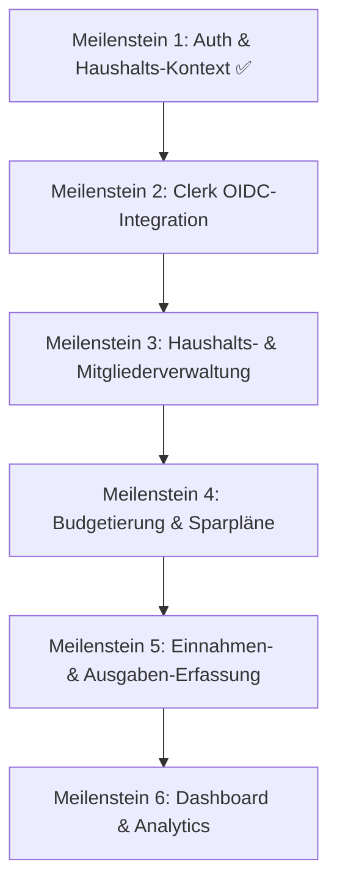

# Projekt-Roadmap & Implementierungsplan

Das Setup mit Nuxt 4, PrimeVue (Aura), Docker-Compose (PostgreSQL) und Prisma ORM läuft erfolgreich. Die Datenbank-Migrationen sind auf dem aktuellen Stand.

Da die Anwendung wichtige Features wie **mehrere Haushalte pro Benutzer**, **mehrere Benutzer pro Haushalt** und **Rollenberechtigungen (Owner/Member)** unterstützt, schlagen wir vor, das Projekt in folgenden aufeinander aufbauenden Meilensteinen zu entwickeln.

---

## Vorgeschlagene Meilensteine

### Meilenstein 1: Auth- & Haushalts-Kontext ✅
* **Status**: Abgeschlossen
* **Ergebnis**: Mock-Auth, Sidebar-Layout, Haushalts-Switcher, Seed-Daten

### Meilenstein 2: Clerk OIDC-Integration 🔜
* **Ziel**: Echte Authentifizierung über Clerk einbinden und den Mock-Modus als Fallback beibehalten.
* **Details**:
  * Installation von `vue-clerk` (offizielles Vue/Nuxt SDK für Clerk).
  * **Dual-Mode Auth-Middleware**: Wenn Clerk-Keys in `.env` gesetzt sind → Clerk-JWT-Validierung. Wenn leer → weiterhin Mock-Modus.
  * **Clerk Webhook** (`POST /api/webhooks/clerk`): Empfängt `user.created` / `user.updated` Events und synchronisiert `User`-Einträge in der lokalen DB (`oidcSubject` = Clerk User ID).
  * **Login-Seite**: Im Clerk-Modus wird `<SignIn />` (Clerk-Komponente) gerendert statt der Mock-Auswahl.
  * **useAuth-Composable**: Wird um Clerk-Session-Erkennung erweitert (Clerk liefert JWT → Server validiert → User-Context wird gesetzt).
  * **Bestehender Mock-Modus bleibt erhalten** – kein Breaking Change für die lokale Entwicklung ohne Clerk-Keys.

### Meilenstein 3: Haushalts- & Mitgliederverwaltung
* **Ziel**: Verwalten von Haushalten und Einladen/Rollenvergabe von Mitgliedern.
* **Details**:
  * Dialog/Formular zur Erstellung neuer Haushalte.
  * Mitglieder-Dashboard: Liste der Mitglieder mit Rollen (`OWNER`, `MEMBER`).
  * Möglichkeit, Einladungen/Mitgliedschaften zu verwalten.

### Meilenstein 4: Budgetierung & Sparpläne (Planungswerte)
* **Ziel**: Anlegen von geplanten Werten (Budgets, Sparziele, geplante Einnahmen und Fixkosten).
* **Details**:
  * CRUD für geplante Einnahmen (`IncomePlan`) und Fixkosten (`FixedCostPlan`) mit Frequenz (monatlich, jährlich etc.).
  * Erstellung von Budgets für Zeiträume (`Budget`).
  * Sparziele-Verwaltung (`SavingsGoal`) mit monatlicher Zielrate.

### Meilenstein 5: Transaktionen (Ist-Werte & Anrechnung)
* **Ziel**: Erfassen von tatsächlichen Ausgaben und Einnahmen und deren Zuweisung.
* **Details**:
  * Transaktionsbuch (Tabelle mit Filtern und Sortierung).
  * Formulare für neue Ausgaben (`ExpenseTransaction`) und Einnahmen (`IncomeTransaction`).
  * Zuweisung einer Ausgabe zu einem Budget (z.B. "Lebensmittel" Budget für Juni) oder Anrechnung auf ein Sparziel.

### Meilenstein 6: Dashboard & Visualisierungen (Rich Aesthetics)
* **Ziel**: Interaktive Monatsübersicht und Finanz-Analytics.
* **Details**:
  * Fortschrittsbalken für Budgets und Sparziele.
  * Einnahmen- vs. Ausgaben-Diagramme (mit PrimeVue Charts / Chart.js).
  * Cashflow-Vorschau basierend auf Plänen und Ist-Werten.

---

## Detailplan: Meilenstein 2 (Clerk OIDC-Integration)

### Open Questions

> [!IMPORTANT]
> 1. **Clerk-Account**: Hast du bereits ein Clerk-Projekt erstellt und die API-Keys (Publishable Key + Secret Key) verfügbar?
> 2. **User-Sync-Strategie**: Soll beim ersten Clerk-Login automatisch ein neuer, leerer Haushalt für den User erstellt werden? Oder muss der User nach dem Login zuerst einem bestehenden Haushalt beitreten?

### Proposed Changes

#### Clerk SDK & Konfiguration

##### [MODIFY] [package.json](file:///Users/jan/Code/family-funds/package.json)
* `vue-clerk` als Dependency hinzufügen.

##### [MODIFY] [nuxt.config.ts](file:///Users/jan/Code/family-funds/nuxt.config.ts)
* Clerk-Runtime-Config registrieren (`runtimeConfig.public.clerkPublishableKey`, `runtimeConfig.clerkSecretKey`).

##### [MODIFY] [.env.example](file:///Users/jan/Code/family-funds/.env.example)
* Dokumentation der benötigten Clerk-Variablen.

---

#### Dual-Mode Auth-Middleware

##### [MODIFY] [auth.ts](file:///Users/jan/Code/family-funds/server/middleware/auth.ts)
* **Clerk-Modus** (Keys vorhanden): JWT aus `Authorization`-Header validieren, `oidcSubject` extrahieren, User in DB laden.
* **Mock-Modus** (Keys leer): Bestehendes Cookie-Verhalten beibehalten.

---

#### Clerk Webhook für User-Synchronisation

##### [NEW] clerk-webhook.post.ts
* `POST /api/webhooks/clerk` – empfängt Clerk-Events (`user.created`, `user.updated`).
* Erstellt oder aktualisiert den `User`-Eintrag in der DB (`oidcSubject` = Clerk User ID, `email` und `displayName` aus Webhook-Payload).
* Signaturverifikation via `svix` (Clerk nutzt Svix für Webhook-Signing).

---

#### Login-Seite (Dual Mode)

##### [MODIFY] [login.vue](file:///Users/jan/Code/family-funds/app/pages/login.vue)
* **Clerk-Modus**: Zeigt die Clerk `<SignIn />`-Komponente.
* **Mock-Modus**: Zeigt weiterhin die Test-User-Auswahl.
* Modus-Erkennung über `useRuntimeConfig().public.clerkPublishableKey`.

##### [MODIFY] [useAuth.ts](file:///Users/jan/Code/family-funds/app/composables/useAuth.ts)
* Erweitern um Clerk-Session-Erkennung via `vue-clerk`.
* Im Clerk-Modus: Token automatisch an API-Requests anhängen.

---

### Verifikationsplan

#### Automatisierte Tests
* Dev-Server starten ohne Clerk-Keys → Mock-Login muss weiterhin funktionieren.
* Dev-Server starten mit Clerk-Keys → Clerk `<SignIn />` wird angezeigt.

#### Manuelle Verifikation
* Clerk-Login im Browser durchführen und prüfen, ob User in der DB angelegt wird.
* Webhook-Endpoint mit Clerk-Dashboard-Testdaten anstoßen.
