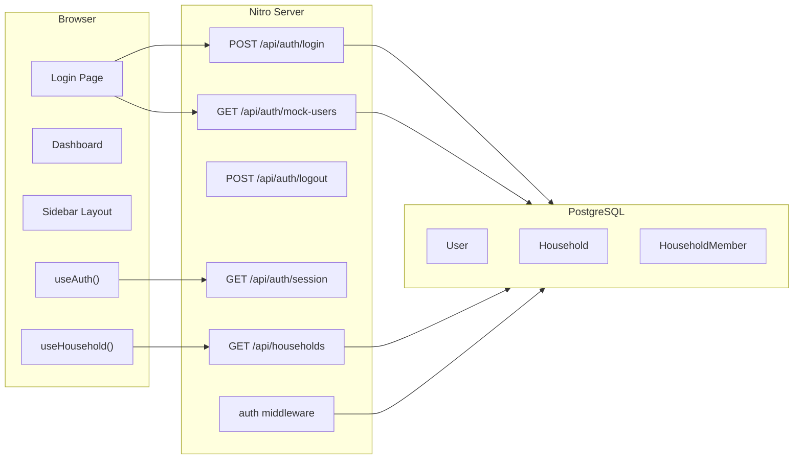

# Walkthrough – Meilenstein 1: Auth & Haushalts-Kontext

## Zusammenfassung

Meilenstein 1 implementiert ein vollständiges **Mock-Authentifizierungssystem** und einen **Haushalts-Kontext** für die lokale Entwicklung. Die App ist jetzt bereit, Funktionen haushaltsbezogen zu entwickeln, ohne dass Clerk-API-Keys konfiguriert sein müssen.

---

## Neue / Geänderte Dateien

### Datenbank & Seeding

| Datei | Beschreibung |
|---|---|
| [seed.ts](file:///Users/jan/Code/family-funds/prisma/seed.ts) | Erstellt 2 Testbenutzer (Jan, Sarah), 3 Haushalte und die zugehörigen Mitgliedschaften |
| [package.json](file:///Users/jan/Code/family-funds/package.json) | `tsx` in devDependencies, `prisma.seed`-Konfiguration hinzugefügt |

### Server-Schicht (Nitro)

| Datei | Beschreibung |
|---|---|
| [prisma.ts](file:///Users/jan/Code/family-funds/server/utils/prisma.ts) | Shared Prisma Client Instanz (Singleton in Dev) |
| [auth.d.ts](file:///Users/jan/Code/family-funds/server/types/auth.d.ts) | H3EventContext-Erweiterung um `user`-Feld |
| [auth.ts](file:///Users/jan/Code/family-funds/server/middleware/auth.ts) | Server-Middleware: liest `session_user_id`-Cookie und lädt User |
| [mock-users.get.ts](file:///Users/jan/Code/family-funds/server/api/auth/mock-users.get.ts) | `GET /api/auth/mock-users` – Liste aller Test-User |
| [login.post.ts](file:///Users/jan/Code/family-funds/server/api/auth/login.post.ts) | `POST /api/auth/login` – setzt Session-Cookie |
| [logout.post.ts](file:///Users/jan/Code/family-funds/server/api/auth/logout.post.ts) | `POST /api/auth/logout` – löscht Session-Cookie |
| [session.get.ts](file:///Users/jan/Code/family-funds/server/api/auth/session.get.ts) | `GET /api/auth/session` – gibt aktuellen User zurück |
| [households.get.ts](file:///Users/jan/Code/family-funds/server/api/households.get.ts) | `GET /api/households` – Haushalte des eingeloggten Users mit Rolle |

### Client-Schicht (Vue/Nuxt)

| Datei | Beschreibung |
|---|---|
| [auth.ts](file:///Users/jan/Code/family-funds/app/types/auth.ts) | `UserSession`-Interface |
| [useAuth.ts](file:///Users/jan/Code/family-funds/app/composables/useAuth.ts) | Composable: Login/Logout/Session-State |
| [useHousehold.ts](file:///Users/jan/Code/family-funds/app/composables/useHousehold.ts) | Composable: Haushaltsliste, aktiver Haushalt (Cookie-persistent) |
| [auth.global.ts](file:///Users/jan/Code/family-funds/app/middleware/auth.global.ts) | Route-Guard: leitet unangemeldete User auf `/login` |
| [login.vue](file:///Users/jan/Code/family-funds/app/pages/login.vue) | Login-Seite mit Glasmorphism-Design |
| [index.vue](file:///Users/jan/Code/family-funds/app/pages/index.vue) | Dashboard mit Haushalts-Banner und Platzhalter-Statistiken |
| [default.vue](file:///Users/jan/Code/family-funds/app/layouts/default.vue) | Sidebar-Layout mit Benutzer, Navigation und Haushalts-Switcher |
| [app.vue](file:///Users/jan/Code/family-funds/app/app.vue) | Vereinfacht auf `<NuxtLayout>` + `<NuxtPage>` |

---

## Architektur-Diagramm

---

## Validierungsergebnisse

Alle API-Endpunkte wurden per `curl` getestet:

| Endpunkt | Status | Ergebnis |
|---|---|---|
| `GET /api/auth/mock-users` | ✅ | 2 User (Jan, Sarah) |
| `POST /api/auth/login` | ✅ | Cookie gesetzt, User-Daten zurückgegeben |
| `GET /api/auth/session` | ✅ | User-Kontext korrekt aus Cookie geladen |
| `GET /api/households` | ✅ | 2 Haushalte für Jan (Gemeinsam + Privat), jeweils mit Rolle `OWNER` |
| `POST /api/auth/logout` | ✅ | Cookie gelöscht |

Dev-Server läuft fehlerfrei auf `http://localhost:3001/`.

---

## Nächster Schritt

> **Bitte öffne `http://localhost:3001/` im Browser**, um Login, Dashboard und Haushalts-Switcher visuell zu überprüfen.

Danach geht es weiter mit **Meilenstein 2: Haushalts- & Mitgliederverwaltung**.
